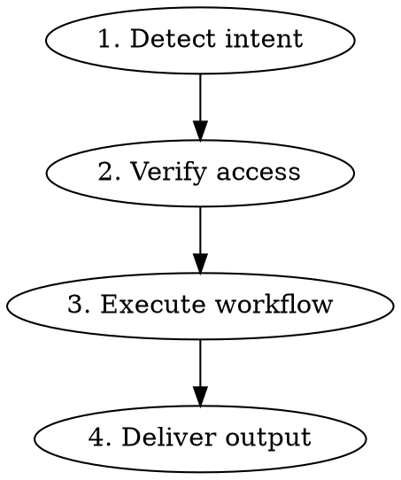

# Canva Skill

Leverage Canva's design platform programmatically — from MCP-powered AI design generation to full Connect API integration.

## Process

### Step 1: Detect Intent

Classify the user's request:

| Intent | Route To |
|--------|----------|
| Set up Canva MCP server | `references/mcp-setup.md` |
| Create / generate designs | `references/design-workflows.md` |
| Export designs (PDF, PNG, etc.) | `references/design-workflows.md` |
| Batch operations / autofill templates | `references/batch-operations.md` |
| Build Canva integration (OAuth, API) | `references/connect-api.md` + `references/authentication.md` |
| Debug errors / fix issues | `references/troubleshooting.md` |

### Step 2: Verify Access

<HARD-GATE>
Before ANY design operation, verify one of these is true:
1. **Canva AI Connector** is configured (Claude Settings > Connectors > Canva), OR
2. **Canva Dev MCP** is installed (`claude mcp add canva-dev`), OR
3. **OAuth tokens** are available (for direct API usage)

If none are configured, route to `references/mcp-setup.md` first.
</HARD-GATE>

### Step 3: Execute Workflow

**4 Workflow Phases:**

#### Phase 1: Setup
- MCP server installation (AI Connector or Dev MCP)
- OAuth configuration (for direct API integration)
- Scope selection based on use case

#### Phase 2: Create
- AI prompt → design generation (via MCP AI Connector)
- Template browsing → autofill (Enterprise)
- File import → edit → customize
- Custom dimensions design creation

#### Phase 3: Manage
- Search existing designs by title/content
- Get design details, pages, thumbnails
- Organize with folders
- Add comments and collaborate

#### Phase 4: Export & Deliver
- Single design export (PDF, PNG, JPG, GIF, PPTX, MP4)
- Multi-format export from one design
- Batch export with rate-limit management
- Design resize for multiple platforms

### Step 4: Deliver Output

Present results with:
- Download URLs (expire in 24 hours — download immediately)
- Edit URLs (expire in 30 days)
- Thumbnail previews (expire in 15 minutes)

## Reference Files

**Always load:**
- `references/mcp-setup.md` — MCP server setup (AI Connector + Dev MCP)

**Load on demand:**

| File | Load When |
|------|-----------|
| `references/design-workflows.md` | Creating, editing, exporting designs |
| `references/connect-api.md` | Developer API questions, building integrations |
| `references/authentication.md` | OAuth setup, token management |
| `references/batch-operations.md` | Template autofill, bulk export, resize at scale |
| `references/troubleshooting.md` | Errors, rate limits, debugging |

## Key Principles

1. **MCP first, API second** — Use Canva AI Connector for design operations before falling back to raw API calls
2. **Async-aware** — Most Canva operations are job-based. Always create job → poll with exponential backoff → handle result
3. **Scope-minimal** — Request only the OAuth scopes needed. `write` does NOT grant `read` — always request both
4. **Rate-limit-respectful** — Implement exponential backoff with jitter. Never brute-force retry on 429
5. **Enterprise transparency** — Clearly flag Autofill API and Brand Templates as Enterprise-only. Don't let users hit 403 walls
6. **URL expiration awareness** — Export URLs: 24h. Thumbnails: 15min. Edit URLs: 30 days. Download immediately

## Plan Requirements

| Feature | Free | Pro/Teams | Enterprise |
|---------|------|-----------|------------|
| Search designs | Yes | Yes | Yes |
| Generate designs | Yes | Yes | Yes |
| Export designs | Yes | Yes | Yes |
| Import files | Yes | Yes | Yes |
| Folders | Yes | Yes | Yes |
| **Resize** | No | **Yes** | **Yes** |
| **Autofill** | No | No | **Yes** |
| **Brand Templates** | No | No | **Yes** |

## Common Mistakes

| Mistake | Fix |
|---------|-----|
| Using `localhost` for OAuth redirect | Use `http://127.0.0.1:<port>` — Canva rejects `localhost` |
| Reusing refresh tokens | Refresh tokens are **single-use**. Store new token from each refresh response. Reuse triggers full revocation |
| Requesting `asset:write` without `asset:read` | Scopes are NOT hierarchical. Request both explicitly |
| Not polling async jobs | Export, import, autofill, resize are all async. Create job → poll → get result |
| Hardcoding export download URLs | URLs expire in 24 hours. Download immediately and store in your own storage |
| Calling Autofill without Enterprise plan | Returns `feature_not_available` (403). Check `GET /v1/users/me/capabilities` first |
| Passing image URL to autofill image field | Image fields require Canva asset IDs. Upload image via Assets API first, then pass `asset_id` |
| Making token exchange from browser | CORS blocks all token endpoints. Must use server-side code |
| Ignoring rate limits on export | Export has layered limits: per-user, per-document, per-integration, and daily caps |
| Not verifying webhook signatures | Always verify `x-canva-signature` header with HMAC-SHA256 before processing |
