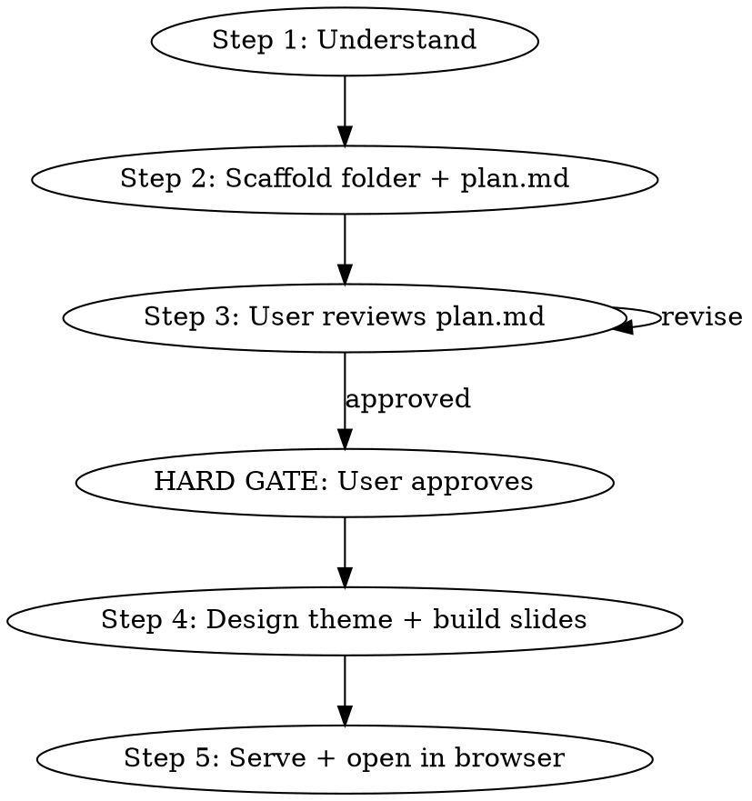

# PowerPoint Deck Generator

Generate consulting-quality presentation decks as HTML/CSS/JS files with 16:9 aspect ratio. Each slide is a separate HTML file, wired together via an `index.html` viewer with arrow-key navigation and PDF export.

Every deck must look like it was crafted by a senior presentation designer — not generated by AI. Every slide must communicate one clear insight via a structured action title + supporting body.

## Process Overview

The process has two phases separated by a hard gate:



<HARD-GATE>
Do NOT generate any slide HTML files until the user has explicitly approved the plan.md. The plan phase and build phase are strictly separated. No exceptions.
</HARD-GATE>

---

## Phase 1: Plan

### Step 1: Understand the Deck

Clarify with the user:
- **Topic and purpose** (pitch deck, conference talk, report, etc.)
- **Audience** (investors, engineers, executives, etc.)
- **Slide count** (single slide or full deck)
- **Visual tone** (dark/light, bold/minimal, playful/corporate)
- **Specific content** for each slide (or generate from topic)

### Step 2: Scaffold Folder + Write plan.md

#### 2a: Create the deck folder

Create a folder with a descriptive kebab-case name:
```
ai-startup-pitch/
quarterly-report-q1-2025/
product-launch-keynote/
```

Check if a folder with this name already exists. Only create a new one if none exists.

#### 2b: Narrative Architecture

Before any visual decisions, structure the argument:

1. **Define the deck's narrative arc** using **SCR** (Situation → Complication → Resolution):
   - **Situation** (10–15% of slides): Uncontroversial baseline — what everyone agrees is true
   - **Complication** (15–20% of slides): Why the situation demands action — the problem or opportunity
   - **Resolution** (60–70% of slides): Your recommendation and supporting evidence

2. **Write all action titles first** (the "ghost deck" approach):
   - Every slide gets a **complete-sentence headline** that states a conclusion — not a topic label
   - Max **2 lines, 15 words**. Must contain a verb. Must be specific and quantitative where possible.
   - Bad: `"Market Analysis"` → Good: `"Revenue declined 8% due to premium segment contraction"`

3. **Apply the storyline test**: Read all action titles in sequence. They must form a coherent, logical argument.

For detailed slide structure methodology, read:
- `~/.claude/skills/powerpoint-deck-generator/references/narrative-structure.md` — action titles, SCR framework, ghost deck, storyline test

#### 2c: Design Direction

Commit to a bold aesthetic direction:

1. **Tone** — Pick a specific aesthetic: brutally minimal, maximalist, retro-futuristic, editorial, luxury, industrial, organic, art deco, brutalist, soft/pastel, cinematic, Swiss/typographic, etc.
2. **Typography** — Distinctive display + body font pair. Never default to overused fonts (Inter, Roboto, Space Grotesk, DM Sans, Poppins).
3. **Color** — 3–4 colors max with functional meaning. Dominant + sharp accent.
4. **Spatial signature** — Layout personality: asymmetric, Swiss grid, overlapping layers, diagonal flow, etc.
5. **Texture & atmosphere** — Noise/grain, geometric patterns, layered transparencies, shadows, gradient meshes, etc.
6. **Differentiator** — One signature element that makes this deck unforgettable.

For detailed design principles, read:
- `~/.claude/skills/powerpoint-deck-generator/references/typography.md` — font selection, banned fonts, size hierarchy
- `~/.claude/skills/powerpoint-deck-generator/references/color-palette.md` — palette construction, accent strategy, theme examples

#### 2d: Write plan.md

Write the complete plan to `<deck-folder>/plan.md`. This file is the single source of truth for the deck before any code is written.

**plan.md format:**

```markdown
# [Deck Title]

## Deck Overview
- **Purpose**: [pitch deck / conference talk / report / etc.]
- **Audience**: [investors / engineers / executives / etc.]
- **Narrative arc**: [1-2 sentence summary of the SCR argument]
- **Total slides**: [N]

## Design Direction
- **Tone**: [specific aesthetic]
- **Display font**: [font name] — [why this font]
- **Body font**: [font name] — [why this font]
- **Color palette**:
  - Background: [color + hex]
  - Text: [color + hex]
  - Accent: [color + hex]
  - Secondary: [color + hex] (if needed)
- **Spatial signature**: [layout personality]
- **Texture**: [atmosphere approach]
- **Differentiator**: [signature element]

## Slide Plan

### Slide 1 — [SCR Phase: Situation/Complication/Resolution]
- **Action title**: "[Complete-sentence headline]"
- **Slide type**: [title / hero metric / comparison / list / chart / quote / etc.]
- **Layout**: [Two-column with hero left + cards right / Full-width card / 3×2 grid / etc.]
- **Body text**: "[1-2 sentence context paragraph below the title]"
- **Primary content**:
  - [Content element 1 with specific data/text]
  - [Content element 2 with specific data/text]
  - [Content element 3 with specific data/text]
  - [Content element 4 with specific data/text]
- **Supporting section**: [Callout bar / Impact row / Comparison / Bottom stat row — describe what goes here]
- **Source**: [data source if applicable]
- **Notes**: [any special layout or visual notes]

### Slide 2 — [SCR Phase]
- **Action title**: "[Complete-sentence headline]"
- **Slide type**: [type]
- **Layout**: [layout description]
- **Body text**: "[context paragraph]"
- **Primary content**:
  - [...]
- **Supporting section**: [...]
- **Source**: [...]

[...repeat for all slides...]

## Density Gate
<CRITICAL>
Before writing the Storyline Test, review every slide plan (except title slides). Each MUST have:
- A **Body text** line (1-2 sentences of narrative context)
- **4+ Primary content** items (data elements, cards, metrics)
- A **Supporting section** (callout bar, impact row, comparison, bottom strip)

If any slide has fewer than 4 content items and no supporting section, it WILL produce an empty slide. Add content or merge with another slide. Do NOT proceed until every slide passes this check.
</CRITICAL>

## Storyline Test
> [Read all action titles in sequence here, numbered, to verify they form a coherent argument]
>
> 1. [Slide 1 action title]
> 2. [Slide 2 action title]
> 3. [Slide 3 action title]
> ...
```

### Step 3: User Review

Present the plan.md to the user and explicitly ask for feedback:

**"Here's the deck plan at `<folder>/plan.md`. Please review:**
- **Slide structure** — right number of slides? right order?
- **Action titles** — do they tell the story you want?
- **Content per slide** — anything missing or unnecessary?
- **Design direction** — does the tone/color/typography feel right?

**Let me know what to change, or say 'go' to start building the deck."**

Iterate on plan.md until the user approves. Update the file with each revision.

<HARD-GATE>
Do NOT proceed to Phase 2 until the user explicitly approves. Phrases like "go", "looks good", "build it", "let's do it", "approved", "진행해", "좋아 만들어" count as approval.
</HARD-GATE>

---

## Phase 2: Build

### Step 4: Design Theme + Build Slides

Only after user approval of plan.md.

#### 4a: Read the Assets

Read the following asset files to use as templates:
- `~/.claude/skills/powerpoint-deck-generator/assets/viewer-template.html` — Template for `index.html`
- `~/.claude/skills/powerpoint-deck-generator/assets/slide-template.html` — Template for individual slide files
- `~/.claude/skills/powerpoint-deck-generator/assets/base-styles.css` — Base CSS to copy and customize as `styles.css`

For design references, read the module index first, then load modules per phase:
- `~/.claude/skills/powerpoint-deck-generator/references/index.md` — routing table: which modules to read per task phase

Key modules for the Build phase:
- `~/.claude/skills/powerpoint-deck-generator/references/layout-composition.md` — density rules, card sizing, spatial patterns
- `~/.claude/skills/powerpoint-deck-generator/references/typography.md` — font hierarchy, size enforcement
- `~/.claude/skills/powerpoint-deck-generator/references/texture-atmosphere.md` — CSS textures, grain, glows, decorative elements
- `~/.claude/skills/powerpoint-deck-generator/references/slide-types.md` — patterns per slide type (title, data, comparison, process, closing)
- `~/.claude/skills/powerpoint-deck-generator/references/print-export.md` — PDF export fixes (backdrop-filter, flex centering)

#### 4b: Create styles.css

Copy from `assets/base-styles.css`, then customize based on plan.md's Design Direction:
- Set `--accent`, `--bg`, `--text` CSS variables per the color palette
- Add Google Font imports for chosen display + body fonts
- Override default fonts, colors, backgrounds
- Add deck-specific utility classes

#### 4c: Create slide files

**`slide-N.html`** (one per slide) — Based on `assets/slide-template.html`:
- Replace `{{SLIDE_TITLE}}` and `{{DECK_TITLE}}` placeholders
- Replace `{{SLIDE_SPECIFIC_STYLES}}` with any per-slide custom CSS
- Replace `{{SLIDE_CONTENT}}` with the slide content HTML
- **Follow the plan.md exactly**: use the action title, slide type, and key content specified
- Each slide must link to `styles.css`
- Each slide is standalone-viewable in a browser
- **Density check before moving on**: After writing each slide, verify it has: (1) body/context text below the title, (2) a filled primary content area with 4+ data elements, and (3) a supporting section at the bottom. If any of these are missing, add content before proceeding to the next slide.

**`export_pdf.py`** — Copy the Playwright-based PDF export script:
```bash
cp ~/.claude/skills/powerpoint-deck-generator/assets/export_pdf.py <deck-folder>/
```

**`index.html`** (the viewer) — Based on `assets/viewer-template.html`:
- Replace `{{DECK_TITLE}}` with the presentation title
- `{{DECK_STYLES}}` → `<link rel="stylesheet" href="styles.css">` (placed BEFORE inline `<style>` block)
- Replace `{{SLIDE_FILES}}` with comma-separated list: `'slide-1.html', 'slide-2.html', ...`
- The viewer dynamically fetches each `slide-N.html` at runtime
- Template includes navigation, scaling, PDF export (via `window.print()` + `@media print`), and fullscreen
- For pixel-perfect PDF export, use: `python3 export_pdf.py` (requires `playwright` and `Pillow`)

### Step 5: Serve and Open in Browser

Start a local server and open in browser. Use `run_in_background` for the server command:
```bash
# Run with run_in_background=true:
python3 -m http.server 8731

# Then separately:
open http://localhost:8731
```

### Step 6: Export PDF

After the user confirms the deck looks good in the browser, **automatically** export a pixel-perfect PDF using the Playwright script:

```bash
cd <deck-folder> && python3 export_pdf.py
```

The script auto-starts its own HTTP server on an available port, so no manual server setup is needed. It loads the **viewer (index.html)** in headless Chromium and navigates through each slide using the viewer's own `showSlide()` function — guaranteeing the PDF is pixel-perfect identical to the browser view. Same CSS cascade, same rendering path.

This step is **mandatory** — every completed deck must have a `deck-export.pdf` ready for the user. Do not skip this step or rely on `window.print()` as a substitute.

## Output Structure

```
deck-name/
├── plan.md             # Deck plan (slide structure, content, design direction)
├── index.html          # Presentation viewer (arrow keys, fullscreen, PDF export)
├── export_pdf.py       # Playwright-based PDF export (pixel-perfect)
├── styles.css          # Deck theme (customized from base-styles.css)
├── slide-1.html        # Individual slides (standalone viewable)
├── slide-2.html
├── slide-3.html
└── ...
```

## Slide Structure Rules (non-negotiable)

These rules govern how every slide is constructed. They are mandatory.

### Action Title

Every slide has a **complete-sentence action title** at the top that states the key insight:
- **Max 2 lines, 15 words**. Contains a verb. States a conclusion, not a topic.
- Specific and quantitative where possible. Active voice.
- All action titles must be **identical font size** across the entire deck — never vary.
- Font size: **36–44px** (action title). Placed at slide top, left-aligned.

### One Message Per Slide

- Each slide communicates **exactly one insight**, stated in the action title and proven by the body
- If you have two messages, make two slides
- The body must prove the title. Nothing in the title absent from the body. Nothing in the body irrelevant to the title.

### Font Size Hierarchy (1920×1080)

**The viewer test**: Imagine someone viewing this slide on a projector at 3 meters, or on a laptop in a meeting room. Every text element must be immediately readable without squinting or leaning in. If you have to ask "is this big enough?" — it isn't.

**Hard floor: nothing below 14px.** The only exception is source citations at the very bottom of a slide. Everything the viewer is meant to actually read must be 22px or above.

Sizes are **mandatory ranges** — never go below minimums. **Always start at the UPPER end of the range, not the lower end.** Users consistently find default sizes too small — err on the side of too large.

| Tier | Element | Size | Weight | Notes |
|------|---------|------|--------|-------|
| **T1** | Action title | 38–44px | 600–700 | Same size on every slide. Left-aligned. |
| **T2** | Subheading / body description below title | 24–28px | 400–500 | Context paragraph. Start at 24px. |
| **T3** | Card content, descriptions, list items | 22–28px | 400 | Line-height 1.4–1.6. **Start at 24px** — this is the default for anything the viewer reads. |
| **T3** | Item titles within cards/lists | 24–28px | 600–700 | Bold sub-items. Never smaller than body text. |
| **Hero** | Key metric / hero number | 64–120px | 700–900 | Accent color. Max 1–2 per slide. |
| **T4** | Category labels, overlines, badges | 14–18px | 600–700 | Uppercase + letter-spacing 0.12–0.2em. |
| **T5** | Source citations, footnotes | 12–14px | 400 | Bottom of slide only. The ONLY text allowed below 14px. |

**The critical rule**: If content is meant to be read (descriptions, explanations, card text, list items), it is **T3 = 24px default, 22px absolute minimum**. Do not invent a smaller tier. If it doesn't fit at 22px, you have too much content — cut words or split the slide. **Never set body/card/description text to 16-20px — this is consistently too small for 1920×1080 slides.**

**Additional rules:**
- Maximum **2 font families** across the entire deck
- Maximum **3 font sizes** per slide (excluding sources/footnotes)
- **Never reduce font size to fit more content** — reduce content or split the slide
- When in doubt, go larger. Oversized text with breathing room always beats cramped small text.

### Content Density

<CRITICAL>
Empty slides are the #1 quality failure. A slide with a title, one stat, and whitespace is a draft — not a finished slide. Unless the user explicitly requests minimal/sparse slides, **always fill the canvas.**
</CRITICAL>

**Canvas fill rule**: Content (excluding source/slide number) must occupy **80%+ of vertical space** (~850–900px of 1080px). Visible empty background = underfilled.

**Comprehension rule**: Despite being filled, each slide must be graspable in **5–10 seconds** and explainable in **60 seconds**. Fill with structured visual elements — not dense paragraphs.

**Every non-title slide requires 5 elements:**

| # | Element | Spec |
|---|---------|------|
| 1 | **Overline** | Section label, uppercase, T4 (14-18px) |
| 2 | **Action title** | Complete-sentence headline, T1 (38-44px) |
| 3 | **Body text** | 1-2 sentences of narrative context, T2 (24-28px) |
| 4 | **Primary content** | Main visual area — cards, grids, columns, hero metrics (4+ data elements) |
| 5 | **Supporting section** | Bottom element — callout bar, impact row, comparison strip, or key quote |

**Density targets by slide type:**

| Slide Type | Primary Zone | Supporting Element |
|------------|-------------|-------------------|
| **Hero metric** | Hero number + label + 3-4 stat cards | Callout bar or context row |
| **Problem/stat** | Two-column: hero left, 4+ stat cards right | Bottom impact row |
| **Solution** | Solution card(s) with sub-sections | Before/after or tagline comparison |
| **Bridge** | 3×2 stat grid or two rich columns | Callout bar with key message |
| **Overview** | 3 rich cards (number + heading + body + stat) | Summary callout |
| **Comparison** | Two-column comparison layout | Transformation row (From → To) |
| **Closing** | Layer cards with descriptions + outcomes | CTA or closing message |

**Anti-sparse test**: After writing a slide, mentally remove the title and source. Does the remaining area look like a designed information layout — or scattered elements on empty space? If the latter, add: body text, more data points, a bottom section, or context within cards.

### Card & Container Sizing (critical CSS rule)

<CRITICAL>
**NEVER use `flex: 1` on card containers inside a column (`flex-direction: column`) parent.** This is the #1 CSS layout bug — it stretches cards vertically to fill remaining space, creating huge empty boxes.

Similarly, **NEVER use `grid-template-rows: 1fr`** for card grids. Use `auto` instead so cards are content-sized.

**The rule**: Cards and content containers must be **content-sized** — they grow to fit their text/data, not stretch to fill available space. The canvas fill rule (80%+) means adding more *content*, not inflating box heights.
</CRITICAL>

**Correct patterns:**
```css
/* WRONG — cards stretch to fill remaining vertical space */
.card-container {
    flex: 1;           /* BAD: stretches container vertically */
    display: grid;
    grid-template-rows: 1fr 1fr;  /* BAD: stretches each row */
}

/* RIGHT — cards are content-sized, bottom elements use margin-top: auto */
.card-container {
    display: grid;
    grid-template-rows: auto auto;   /* content-sized rows */
    align-content: center;           /* vertically center if extra space */
}

/* Use flex: 1 ONLY for equal-width columns (flex-direction: row) */
.column { flex: 1; }  /* OK: equal width in a row layout */
```

**When to use `flex: 1`:**
- Equal-width columns in a **row** layout → OK
- Card containers in a **column** layout → NEVER
- Tables, registries, or elements that genuinely should fill available height → OK with caution

**Self-check after writing each slide:** Open the slide in the browser and check if any card has large empty space below its text content. If so, the container is incorrectly using `flex: 1` or `grid-template-rows: 1fr`.

## Slide Aesthetics (mandatory)

Apply these on every deck. They are non-negotiable.

**Typography**: Choose fonts that are beautiful, unique, and context-appropriate. NEVER default to overused fonts (Inter, Roboto, Space Grotesk, DM Sans, Poppins, Montserrat, Open Sans, Lato). Pair a distinctive display font with a refined body font. Dramatic weight contrast and careful letter-spacing separate designed slides from generated slides.

**Spatial composition**: Break out of centered-text-on-flat-background. Use asymmetric placement, off-center hero elements, overlapping layers, diagonal flow, grid-breaking elements. Every slide should feel composed, not templated.

**Atmosphere & texture**: Slides need depth, not flat solid colors. Add contextual texture: subtle noise/grain overlays via CSS, geometric patterns, layered transparencies, dramatic shadows, fine-line decorative elements, or gradient meshes. Match texture to tone.

**Color conviction**: Dominant colors with sharp accents > timid evenly-distributed palettes. A confident dark background with one electric accent always beats a safe gray with muted blue. Color must carry **functional meaning** — not decoration.

**Variation across decks**: No two decks should look the same. Vary themes, fonts, color palettes, and layout patterns between projects. NEVER converge on the same choices across generations.

**NEVER** produce generic AI aesthetics:
- Overused font families (Inter, Roboto, DM Sans, Poppins, system fonts)
- Cliched color schemes (purple gradients on white, blue-to-teal gradients)
- Predictable centered layouts on every slide
- Cookie-cutter card grids with uniform rounded corners
- Flat solid backgrounds with no texture or atmosphere
- Safe, timid color palettes that avoid any bold commitment
- Topic labels as slide titles instead of action titles

## PDF Export

### How it works

`export_pdf.py` opens the **viewer (index.html)** in headless Chromium — the exact same page the user sees in the browser. It navigates through each slide using the viewer's own `showSlide()` function, screenshots at 2x resolution (3840×2160), and combines into a PDF. This guarantees **browser view = PDF output** with zero CSS divergence.

### Why viewer-based (not standalone slides)

Individual `slide-N.html` files have their own `<style>` block for standalone viewing (centering, scaling). The viewer applies a different CSS cascade (viewer inline CSS + styles.css). Exporting standalone slides produces subtly different rendering. By exporting through the viewer, the CSS cascade is identical — what you see is what you get.

### Usage

```bash
# Requires: pip install playwright Pillow && playwright install chromium
python3 export_pdf.py                    # Export all slides (auto-starts server)
python3 export_pdf.py --output deck.pdf  # Custom output filename
python3 export_pdf.py --port 8731        # Custom port (default: auto-find)
python3 export_pdf.py --no-server        # Don't auto-start server (expects one running)
```

### Browser Print (quick export)

The viewer's `P` key triggers `window.print()` with `@media print` CSS. The viewer template includes two automatic fixes for Chrome's print rendering bugs:

1. **CSS fix**: `@media print` globally disables `backdrop-filter` on all elements (Chrome hides elements with `backdrop-filter` AND all their children in print mode).
2. **JS fix**: `exportPDF()` scans all elements for `backdrop-filter` usage before printing and temporarily replaces semi-transparent `rgba()` backgrounds with solid `#141420` — because without the blur effect, semi-transparent backgrounds become invisible against dark slide canvases.

These fixes are built into the viewer template and apply automatically to all future decks.

**No CSS restrictions.** Playwright uses real Chromium rendering. Use any CSS freely: `backdrop-filter`, `radial-gradient()`, CSS variables, `mix-blend-mode`, complex `clip-path`, etc. The browser print path also handles these correctly via the built-in fixes above.

## Common Mistakes

| Mistake | Fix |
|---------|-----|
| **Card boxes too tall / empty space inside cards** | **NEVER use `flex: 1` on card containers in column layouts. NEVER use `grid-template-rows: 1fr` for card grids. Use `auto` rows and content-sized containers. Cards must fit their content, not stretch to fill space.** |
| Skipping plan.md and going straight to slides | Phase 1 is mandatory. Always write plan.md and get approval first. |
| Topic labels as titles ("Market Analysis") | Write action titles: complete sentences stating a conclusion |
| **Empty/sparse slides (THE #1 MISTAKE)** | **Every slide must fill 80%+ of the canvas. Add body text under title, 4+ data elements in primary area, and a supporting section (callout bar, comparison row, impact items) at the bottom. If a slide has a title, one stat, and whitespace — it is a draft, not a slide.** |
| Inconsistent title sizes across slides | Action title font size must be identical on every slide |
| **Font sizes too small (THE #2 MISTAKE)** | **Body/card/description text must START at 24px, never below 22px. Users consistently find 16-20px text too small on 1920×1080 slides. When in doubt, go bigger — 24px is the default, not the ceiling.** |
| Card text / descriptions below 22px | All readable text is T3 (24px default). If it doesn't fit at 22px, cut words or split the slide. Never use 16-20px for descriptive text. |
| Body content doesn't support the title | Everything on the slide must prove the action title. Apply "so what" test. |
| No narrative arc across the deck | Use SCR. Write all titles first. Apply storyline test. |
| Using default/overused fonts | Pick distinctive Google Fonts that match the tone |
| Every slide is centered text on flat bg | Use asymmetric layouts, off-center elements, overlapping layers |
| Flat solid color backgrounds | Add texture: noise, patterns, gradients, shadows, decorative elements |
| Same design across every deck | Vary fonts, colors, layout patterns between projects |
| Missing source citations | Every data claim needs a source (12–14px, bottom of slide) |
| Inconsistent padding/spacing | Define once in styles.css, reuse everywhere |
| Forgetting to open in browser | Always serve via `python3 -m http.server` and open via `http://localhost` |
| Opening index.html via file:// | Dynamic slide loading requires HTTP — always use a local server |
| Not customizing base-styles.css | The base is a starting point — always set theme colors and fonts |
| Slides not standalone-viewable | Each slide-N.html must link to styles.css and include scaling JS |
| plan.md doesn't match final slides | Final slides must follow plan.md exactly — it's the source of truth |
| `backdrop-filter` elements vanish in browser print PDF | Chrome's print engine hides elements with `backdrop-filter` AND all children. The viewer template handles this automatically (CSS disables backdrop-filter in `@media print`, JS replaces semi-transparent backgrounds with solid ones before printing). No action needed if using the template. |
| Text inside flex containers shifts in print/PDF export | Never rely on flex `justify-content: center` alone for text centering. Always add `display: block; width: 100%; text-align: center;` on the text element as a failsafe. Especially critical for hero numbers inside colored bars/boxes. |
