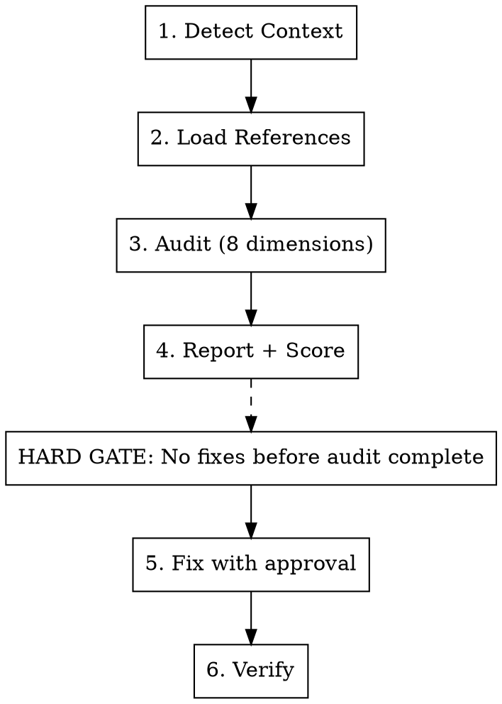

# SEO + GEO Optimizer

Audit and optimize web projects for both traditional search engines (Google, Naver, Bing) and AI answer engines (ChatGPT, Perplexity, Google AI Overviews, Gemini, Claude).

## Process



### Step 1: Detect Context

Scan the project to determine **framework** and **market**:

**Framework detection:**
- **Next.js App Router**: `app/` directory, `layout.tsx`, `metadata` exports
- **Next.js Pages Router**: `pages/` directory, `_app.tsx`, `next-seo` usage
- **React (Vite/CRA)**: `index.html`, `react-helmet`, `vite.config`

**Market detection:**
- **Korean target**: `/ko/` routes, `next-intl`, Korean content, `.co.kr` domain, Naver references
- **Global/English only**: No Korean language indicators
- **Bilingual**: Both Korean and English routes present

Store detected context — it determines which references to load.

### Step 2: Load References (Modular Router)

Always load:
- `references/seo-checklist.md` — Meta tags, structured data, E-E-A-T, Core Web Vitals, internal linking
- `references/geo-checklist.md` — AI citation optimization, answer capsules, platform-specific strategies
- `references/ai-crawlers.md` — Complete AI crawler list, robots.txt patterns

Load conditionally:
- `references/naver-optimization.md` — **Load if Korean market detected** (C-Rank, D.I.A., AI Briefing, Search Advisor, SmartStore)
- `references/technical-seo.md` — **Load if issues found** in redirects, 404s, pagination, or canonical conflicts
- `references/dynamic-og-images.md` — **Load if** project lacks dynamic OG images or has social sharing features
- `references/measurement.md` — **Load if** user asks about tracking GEO performance or AI traffic analytics

### Step 3: Audit Across 8 Dimensions

<HARD-GATE>
Complete ALL 8 dimensions before proposing ANY code changes.
Do NOT fix issues as you find them — audit first, fix after.
</HARD-GATE>

#### Dimension 1: Meta & Head Tags
Scan all pages/layouts for: title tags, meta descriptions, OG tags, Twitter cards, canonical URLs, viewport, favicon, hreflang. Check for duplicates across pages.

#### Dimension 2: Structured Data
Check for JSON-LD `<script type="application/ld+json">` blocks. Validate schema types match page content. Flag missing schemas. Check for XSS-safe serialization (`replace(/</g, '\\u003c')`). Verify `datePublished`/`dateModified` on Article schemas.

**Minimum schema requirements:**
- Homepage: `WebSite` + `Organization`
- Content pages: `Article` + `BreadcrumbList`
- FAQ sections: `FAQPage` (dual-purpose: Google snippets + AI citations)
- Product pages: `Product` with `offers`
- Author pages: `Person` with `sameAs` links

#### Dimension 3: AI Crawler Access
Read `references/ai-crawlers.md` for the complete crawler list. Check `robots.txt` (or `app/robots.ts`) for all 3 tiers:
- **Training crawlers**: GPTBot, ClaudeBot, Meta-ExternalAgent, Bytespider, Amazonbot
- **Search crawlers**: OAI-SearchBot, PerplexityBot, Claude-SearchBot, DuckAssistBot
- **User-triggered**: ChatGPT-User, Claude-User, Perplexity-User

Verify sitemap exists and covers all public pages. Check meta robots directives.

#### Dimension 4: Content Structure (GEO)
For each content page, check against `references/geo-checklist.md`:
- Answer capsules after H2/H3 headings (40-80 words, direct answers)
- Question-format headers (3.4x higher extraction rate)
- Paragraph length under 60 words (optimal for AI extraction)
- Self-contained sections (no cross-references)
- Statistics and citations in content (30-40% visibility improvement)
- FAQ section paired with `FAQPage` structured data (28% citation lift)
- Tables for comparative data (81% extraction rate vs 23% for paragraphs)

#### Dimension 5: Technical SEO
Check for issues covered in `references/technical-seo.md`:
- Redirect chains or incorrect status codes (301 vs 308)
- Canonical conflicts (trailing slash, www, query params)
- Soft 404s (dynamic routes returning 200 for missing data)
- Pagination without self-referencing canonicals
- `notFound()` called after streaming starts (soft 404 trap)

#### Dimension 6: Performance & Core Web Vitals
Check against current thresholds:

| Metric | Good | Competitive |
|--------|------|-------------|
| LCP | < 2.5s | < 2.0s |
| INP | < 200ms | < 150ms |
| CLS | < 0.1 | < 0.05 |

Check: `next/image` usage, `next/font`, `priority` on hero images, `Script strategy="lazyOnload"` for third-party scripts, Server Components by default, `startTransition` for non-urgent updates.

#### Dimension 7: E-E-A-T Signals
Check for trust and authority indicators:
- Author bylines with linked profile pages
- `Person` schema with `sameAs` (LinkedIn, GitHub, Twitter)
- `datePublished` and `dateModified` on all content
- Visible "Last updated" dates
- About page with organization details
- External citations and references in content

#### Dimension 8: i18n & Korean Market
Check hreflang tags, `<html lang>` attribute, alternates in sitemap.

**If Korean market detected**, read `references/naver-optimization.md` and additionally check:
- Naver Search Advisor registration
- `naver-site-verification` meta tag
- `keywords` meta tag (Naver still reads it, unlike Google)
- Korean meta descriptions (70-80 chars, mobile-safe at 40 chars)
- SSR/SSG for all pages (Yeti bot has limited JS rendering)
- Naver Blog/Cafe ecosystem strategy
- AI Briefing optimization (FAQ structure, opening paragraph answers)

### Step 4: Report + Score

Present findings in this format:

```
## SEO + GEO Audit Report

### Critical (blocks indexing or AI citation)
- [ ] Issue → file:line → fix

### Warning (reduces visibility)
- [ ] Issue → file:line → fix

### Suggestion (optimization opportunity)
- [ ] Issue → file:line → fix

### SEO Score: X/100
- Meta & Head Tags: X/15
- Structured Data: X/15
- AI Crawler Access: X/10
- Technical SEO: X/15
- Performance (CWV): X/15
- E-E-A-T Signals: X/10
- i18n: X/10 (or N/A)
- Naver Optimization: X/10 (if Korean market)

### GEO Score: X/100
- Answer capsules: X/Y pages (target: 100%)
- Question-format headers: X/Y H2+H3 tags
- FAQ + FAQPage schema: X/Y content pages
- Self-contained sections: X% compliant
- Statistics/citations in content: X/Y pages
- AI crawler access: [allowed/blocked] per crawler tier
- Structured data coverage: X/Y pages
- Content freshness signals: [present/missing]
- Measurement setup: [configured/not configured]

### Grade: [A/B/C/D/F]
- A (90-100): Production-ready, fully optimized
- B (75-89): Good foundation, minor gaps
- C (60-74): Functional but missing key optimizations
- D (40-59): Significant issues affecting visibility
- F (0-39): Critical problems blocking indexing/citation
```

### Step 5: Fix with Approval

Present fixes in groups. Apply each group **only after user approval**:

**Group A — Infrastructure**: robots.txt (AI crawlers), sitemap, meta config, redirects
**Group B — Metadata**: title tags, descriptions, OG/Twitter, hreflang, canonical URLs
**Group C — Structured Data**: JsonLd component, page-level schemas, E-E-A-T markup
**Group D — Dynamic OG Images**: `opengraph-image.tsx` for social sharing (read `references/dynamic-og-images.md`)
**Group E — GEO Content**: answer capsules, FAQ sections, content restructuring, tables
**Group F — Technical SEO**: 404 handling, redirects, pagination, canonical fixes
**Group G — Performance**: image optimization, font loading, dynamic imports, script strategy
**Group H — Naver** (if Korean): Search Advisor setup, Naver-specific meta tags, SSR verification

For each fix, show before/after diff clearly.

#### Reusable Components to Generate

**`JsonLd` component** — XSS-safe JSON-LD injector:
```tsx
export function JsonLd({ data }: { data: Record<string, unknown> }) {
  return (
    <script
      type="application/ld+json"
      dangerouslySetInnerHTML={{
        __html: JSON.stringify(data).replace(/</g, '\\u003c'),
      }}
    />
  );
}
```

**`FAQSection` component** — Visible FAQ + paired `FAQPage` schema. Accepts `{ question, answer }[]`.

**`AnswerCapsule` component** (optional) — Highlighted summary block for top of sections.

### Step 6: Verify

After applying fixes:
1. Run `next build` to catch metadata errors
2. Verify `robots.txt` accessible and AI crawlers allowed (all 3 tiers)
3. Validate JSON-LD syntax — link to [Google Rich Results Test](https://search.google.com/test/rich-results)
4. Confirm no duplicate `<title>` or `<meta description>` tags
5. Verify hreflang reciprocity (en ↔ ko, with x-default)
6. Check canonical URLs resolve correctly (no chains, no loops)
7. Verify `notFound()` returns HTTP 404 (not soft 404)
8. Test OG images render correctly — [Facebook Sharing Debugger](https://developers.facebook.com/tools/debug/)
9. If Korean: verify Naver Search Advisor shows site as registered

## Key Principles

- **SEO is the foundation of GEO** — AI engines pull from top-ranking results. Fix SEO first.
- **Answer capsules = #1 GEO technique** — 72% of AI-cited pages use them (40-80 words, direct answer after heading).
- **Statistics boost citations 30-40%** — Include specific numbers, dates, percentages in content.
- **FAQPage schema = GEO cheat code** — 28% citation lift + 3.2x AI Overview appearance rate.
- **Tables > paragraphs for data** — 81% extraction rate vs 23%. Always use tables for comparisons.
- **Self-contained sections** — AI extracts fragments. Every section must stand alone.
- **Don't block AI crawlers** — 20+ crawlers across 3 tiers. Check all of them.
- **Content freshness matters** — AI-cited content is 25.7% fresher than organic results. Add "Last updated" dates.
- **Korean SEO = Naver + Google** — Google Korea surpassed 49% share in 2025. Optimize for both.
- **E-E-A-T is not optional** — Author schema, credentials, and trust signals affect both Google and AI citation.

## Reference Files

**Always loaded:**
- **`references/seo-checklist.md`**: Meta tags, structured data, E-E-A-T, Core Web Vitals, internal linking, Next.js patterns
- **`references/geo-checklist.md`**: AI citation optimization, answer capsules, platform-specific strategies, content rewriting, freshness signals
- **`references/ai-crawlers.md`**: Complete 20+ crawler list with user-agent strings, 3-tier classification, robots.txt strategies

**Conditionally loaded:**
- **`references/naver-optimization.md`**: C-Rank, D.I.A., AI Briefing, Search Advisor setup, Korean content specs, SmartStore, ecosystem strategy
- **`references/technical-seo.md`**: Redirects (301 vs 308), 404/soft 404, pagination, canonical conflicts, SSG/SSR/ISR comparison
- **`references/dynamic-og-images.md`**: `opengraph-image.tsx` patterns, `ImageResponse`, Korean fonts, debugging tools
- **`references/measurement.md`**: GA4 blind spots, server log analysis, GEO monitoring tools, key metrics

## Common Mistakes

| Mistake | Fix |
|---------|-----|
| Blocking AI crawlers in robots.txt | Allow all 3 tiers: Training + Search + User-triggered (see `ai-crawlers.md`) |
| Only checking 5 crawlers | 20+ AI crawlers exist. Check `ai-crawlers.md` for the complete list |
| Generic headers ("Introduction") | Use question-format headers ("What Is X?", "How X Works") — 3.4x extraction rate |
| Cross-referencing between sections | Make each section self-contained — AI may extract only one fragment |
| Missing FAQPage schema | Pair visible FAQ with JSON-LD FAQPage — 28% citation lift |
| Same meta description on all pages | Every page needs unique description (150-160 chars EN, 70-80 chars KO) |
| No answer capsule after headings | Add 40-80 word direct answer after every H2/H3 — 72% of cited pages use them |
| Vague content without data | Include statistics, numbers, dates — 30-40% higher AI citation rate |
| Paragraphs for comparison data | Use tables — 81% extraction rate vs 23% for paragraphs |
| Forgetting Naver for Korean sites | Register at Search Advisor + add verification meta + SSR for Yeti bot |
| JSON-LD without XSS prevention | Use `.replace(/</g, '\\u003c')` when serializing JSON-LD |
| `notFound()` after streaming starts | Call `notFound()` BEFORE any JSX — streaming locks HTTP 200 |
| No `dateModified` in Article schema | Always include `datePublished` and `dateModified` — freshness is machine-readable |
| Ignoring E-E-A-T signals | Add Person schema, author pages, credentials, "Last updated" dates |
| Not measuring GEO performance | GA4 is blind to AI traffic — use server logs or dedicated tools (see `measurement.md`) |
