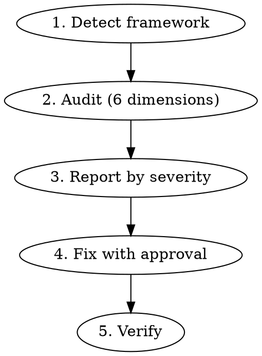

# SEO + GEO Optimizer

Audit and optimize web projects for both traditional search engines (Google, Naver, Bing) and AI answer engines (ChatGPT, Perplexity, Google AI Overviews, Gemini, Claude).

## Process



### Step 1: Detect Framework

Scan the project to determine:
- **Next.js App Router**: Look for `app/` directory, `layout.tsx`, `metadata` exports
- **Next.js Pages Router**: Look for `pages/` directory, `_app.tsx`, `next-seo` usage
- **React (Vite/CRA)**: Look for `index.html`, `react-helmet`, `vite.config`
- **Language setup**: Check for i18n config, `/ko/` or `/en/` routes, `next-intl`, `next-i18next`

Set the framework context for all subsequent steps.

### Step 2: Audit Across 6 Dimensions

Run each audit dimension. For detailed checklists and code patterns:
- **SEO (dimensions 1, 2, 3, 5, 6)**: Read `references/seo-checklist.md`
- **GEO (dimension 4)**: Read `references/geo-checklist.md`

#### Dimension 1: Meta & Head Tags
Scan all pages/layouts for: title tags, meta descriptions, OG tags, Twitter cards, canonical URLs, viewport, favicon, hreflang.

#### Dimension 2: Structured Data
Check for JSON-LD `<script type="application/ld+json">` blocks. Validate schema types match page content. Flag missing schemas (every page needs at minimum `WebSite` or `Organization` on homepage, `Article` on blog posts, `BreadcrumbList` on nested pages).

#### Dimension 3: Crawlability
Check `robots.txt` (or `app/robots.ts`) for AI crawler access. Verify sitemap exists and covers all public pages. Check meta robots directives. **Critical**: Verify GPTBot, PerplexityBot, OAI-SearchBot, ChatGPT-User, ClaudeBot are NOT blocked.

#### Dimension 4: Content Structure (GEO)
For each content page, check:
- Answer capsules after H2/H3 headings (2-4 sentence direct answers)
- Paragraph length under 120 words
- Self-contained sections (no "as mentioned above" cross-references)
- Quotable statements with specific data/statistics
- FAQ section paired with `FAQPage` structured data
- Descriptive headers (not generic like "Introduction", "Overview")

#### Dimension 5: Performance
Check image optimization (next/image), font loading (next/font), dynamic imports for heavy components, Core Web Vitals signals.

#### Dimension 6: i18n (Korean + English)
Check hreflang tags, Naver site verification meta tag, Korean-specific meta descriptions (80-120 chars), `<html lang>` attribute, alternates in sitemap.

### Step 3: Report by Severity

Present findings in this format:

```
## SEO + GEO Audit Report

### Critical (blocks indexing or AI citation)
- [ ] Issue → file:line → fix

### Warning (reduces visibility)
- [ ] Issue → file:line → fix

### Suggestion (optimization opportunity)
- [ ] Issue → file:line → fix

### GEO Score
- Answer capsules: X/Y pages
- FAQ sections: X/Y content pages
- Self-contained sections: X% compliant
- AI crawler access: [allowed/blocked] per crawler
- Structured data coverage: X/Y pages
```

### Step 4: Fix with Approval

Present fixes in groups. Apply each group only after user approval:

**Group A — Infrastructure**: robots.txt, sitemap, meta config
**Group B — Metadata**: title tags, descriptions, OG/Twitter, hreflang
**Group C — Structured Data**: JSON-LD components + page-level schemas
**Group D — GEO Content**: answer capsules, FAQ sections, content restructuring
**Group E — Performance**: image optimization, font loading, dynamic imports

For each fix, show before/after diff clearly.

#### Reusable Components to Generate

Create shared components the project can reuse:

**`JsonLd` component** — Generic JSON-LD injector:
```tsx
export function JsonLd({ data }: { data: Record<string, unknown> }) {
  return (
    <script
      type="application/ld+json"
      dangerouslySetInnerHTML={{ __html: JSON.stringify(data) }}
    />
  );
}
```

**`FAQSection` component** — Visible FAQ + paired `FAQPage` schema. Accepts `{ question, answer }[]`.

**`AnswerCapsule` component** (optional) — Highlighted summary block for top of sections.

### Step 5: Verify

After applying fixes:
1. Verify `robots.txt` syntax (no errors, AI crawlers allowed)
2. Validate JSON-LD — link to Google Rich Results Test
3. Confirm no duplicate `<title>` or `<meta description>` tags
4. Verify hreflang reciprocity (en ↔ ko)
5. Run `next build` (Next.js) to catch metadata errors

## Key Principles

- **SEO is the foundation of GEO** — AI engines pull from top-ranking results. Fix SEO first.
- **Answer capsules = #1 GEO technique** — 40% higher citation rate. Always add them.
- **Self-contained sections** — AI extracts fragments. Every section must stand alone.
- **Don't block AI crawlers** — Many sites accidentally block GPTBot/PerplexityBot.
- **FAQPage schema is dual-purpose** — Works for both Google snippets AND AI citations.
- **Korean SEO needs Naver** — Always include Naver verification and optimization.
- **Content freshness** — Add "Last updated" dates. AI engines weight recency.

## Reference Files

- **`references/seo-checklist.md`**: Detailed SEO audit items with code patterns for meta tags, structured data, crawlability, performance, and i18n. Read at the start of every audit.
- **`references/geo-checklist.md`**: GEO-specific checklist covering answer capsules, FAQ optimization, AI crawler access, platform-specific patterns (ChatGPT vs Perplexity vs Google AI Overviews), and content rewriting guidelines. Read when working on GEO dimension or content fixes.

## Common Mistakes

| Mistake | Fix |
|---------|-----|
| Blocking AI crawlers in robots.txt | Explicitly allow GPTBot, PerplexityBot, OAI-SearchBot, ChatGPT-User, ClaudeBot |
| Generic headers ("Introduction") | Use descriptive, question-based headers ("What Is X?", "How X Works") |
| Cross-referencing between sections | Make each section self-contained — AI may extract only one fragment |
| Missing FAQPage schema | Always pair visible FAQ sections with JSON-LD FAQPage markup |
| Same meta description on all pages | Every page needs unique, specific description (150-160 chars EN, 80-120 chars KO) |
| Forgetting Naver for Korean sites | Add naver-site-verification meta tag and register at Naver Search Advisor |
| No answer capsule after headings | Add 2-4 sentence direct answer immediately after every H2/H3 |
| Vague content without data | Include specific statistics, numbers, dates — 30-40% higher AI citation rate |
